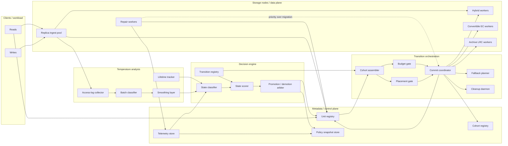
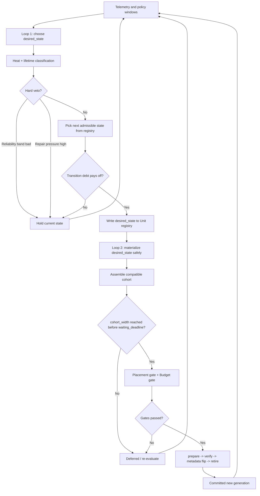
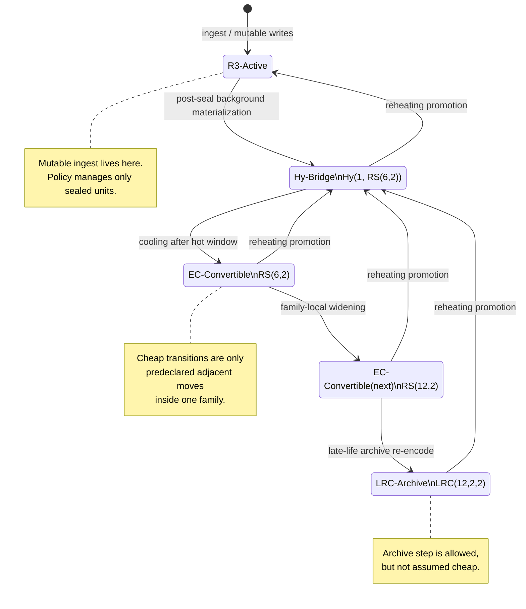
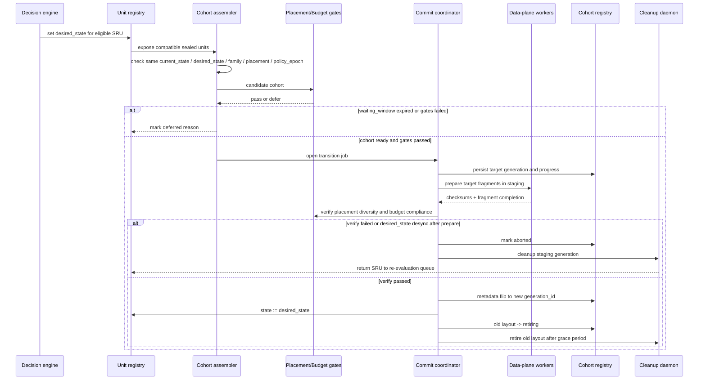
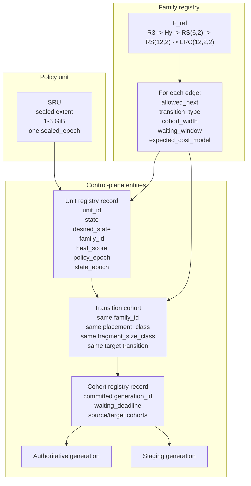
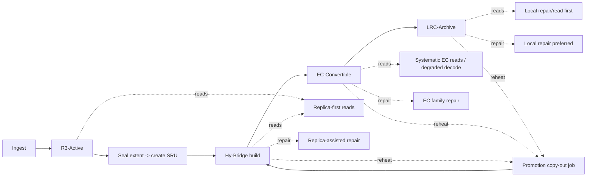

# Diagrams for `design_16`

Этот файл собирает схемы для [design_16.md](./design_16.md): компоненты, связи, lifecycle pipeline, transition protocol и ключевые сущности control plane.

## 1. Компоненты и связи

## 2. Dual-loop controller

## 3. Lifetime pipeline и reference family

## 4. Transition protocol for one cohort

## 5. Модель сущностей control plane

## 6. Основные operational paths

