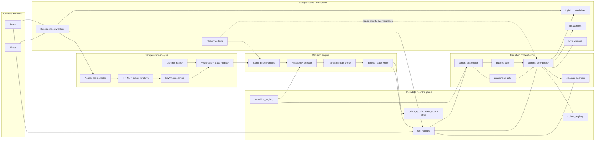
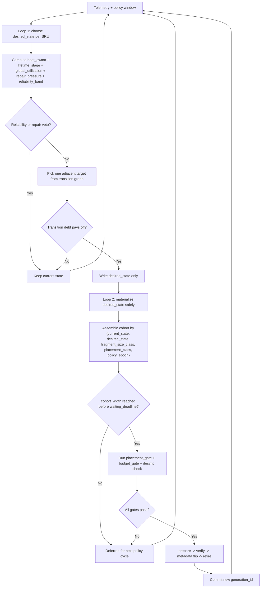
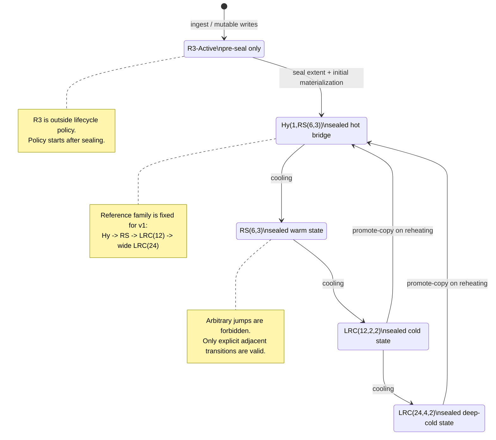
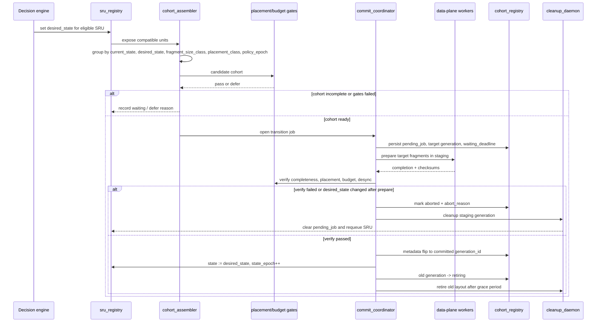
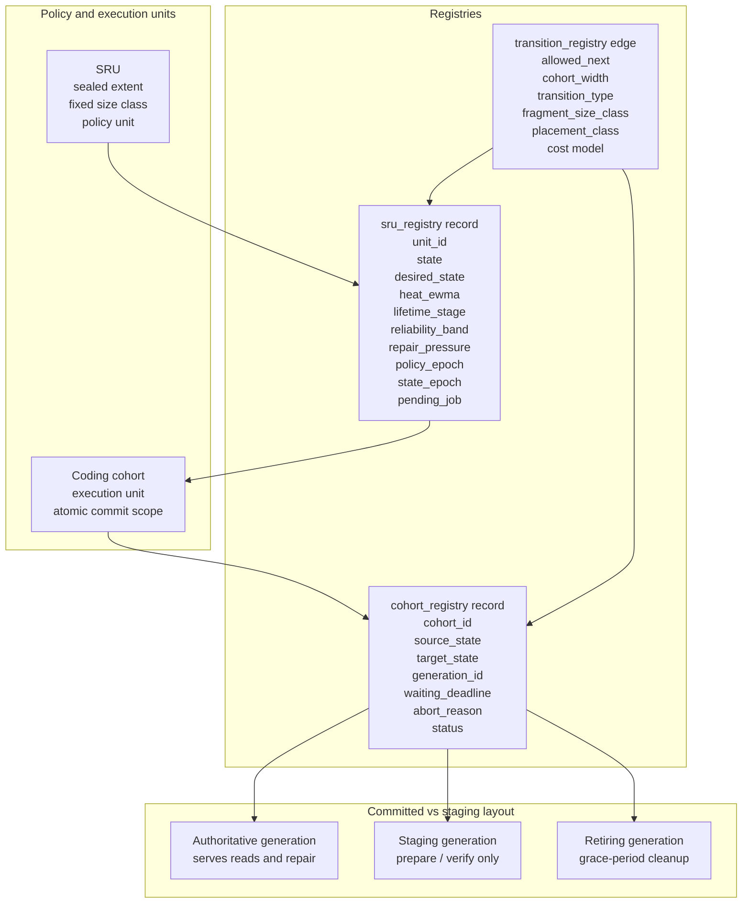
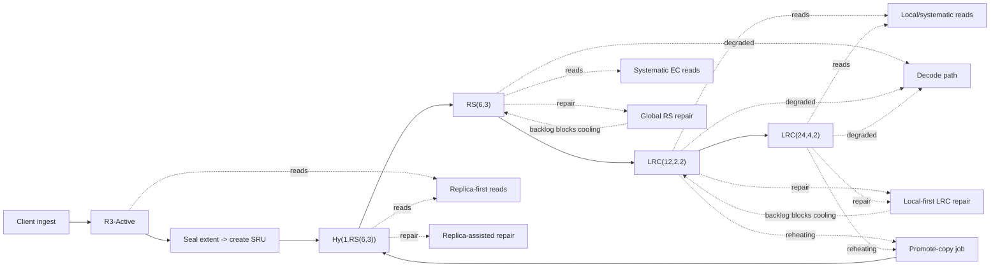
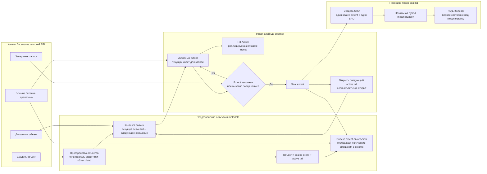
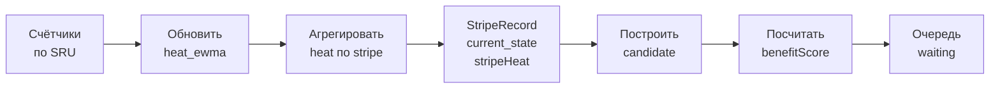
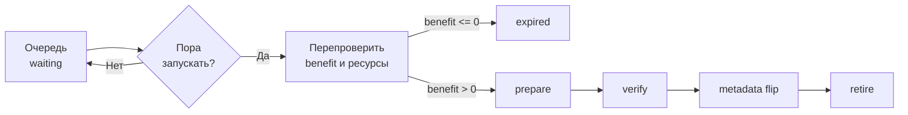

# Diagrams for `design_17`

Этот файл собирает схемы для [design_17.md](./design_17.md): компоненты, связи, dual-loop control, lifecycle pipeline, transition protocol и ключевые сущности control plane.

## 1. Компоненты и связи

## 2. Dual-loop / policy-execution control

## 3. Lifecycle pipeline и reference family

## 4. Transition protocol for one cohort

## 5. Модель control-plane entities

## 6. Основные operational paths

## 7. Пользовательский API и ingest-слой

## 8. MVP Stripe-First Policy / Execution Model

**8.1 Политика**

**8.2 Запуск**

Ключевая идея этой схемы:

- `heat` считается на `SRU`;
- `current_state` и aggregated heat живут на `StripeRecord`;
- `desired_state` и `benefitScore` живут на `TransitionCandidate`;
- в wait queue лежат только полные executable candidates, поэтому timeout означает `launch or expire`, а не partial commit.
