# Ревью ВКР: суть, форма, англицизмы, связность, литература

Ниже — структурированное ревью текста `main.tex` и всех `sections/*.tex`. Замечания собраны по приоритету и сгруппированы по типу. По итогам ревью в конце документа есть план правок.

---

## 1. Англицизмы и транслитерации англицизмов кириллицей

Это главный пункт по просьбе. В тексте есть несколько мест, где либо стоит латиница в основном тексте, либо транслитерация англицизма кириллицей. Их желательно заменить на русские эквиваленты или хотя бы ввести один раз русский эквивалент перед использованием аббревиатуры.

### 1.1 Явные англицизмы (латиница) в основном тексте

| Где | Что | Предложение |
|---|---|---|
| [`sections/implementation.tex`](sections/implementation.tex:142) | «переходы реализуются **parity-only**» | «переходы реализуются только над проверочными блоками» / «без перечитывания блоков данных»; вместо `parity-only` ввести термин «преобразование только над проверочными блоками» один раз и использовать его |
| [`sections/implementation.tex`](sections/implementation.tex:188) | «глобальные проверочные блоки преобразуются **parity-only**» | то же |
| [`sections/implementation.tex`](sections/implementation.tex:190) | «глобальные проверочные блоки дочерних схем преобразуются **parity-only**» | то же |
| [`sections/implementation.tex`](sections/implementation.tex:134) | «**XOR** по всем блокам данных» | XOR — общепринятое обозначение, но в тексте уместно один раз дать «побитовое исключающее ИЛИ (XOR)», а далее использовать XOR |
| [`sections/solution.tex`](sections/solution.tex:209) | «**EWMA**» | в теории уже введено «экспоненциальное сглаживание». Здесь стоит ввести аббревиатуру один раз: «экспоненциально взвешенное скользящее среднее, далее EWMA» в первой главе и далее единообразно (сейчас «EWMA» появляется в `solution.tex` и `implementation.tex`, но не введена в `theory.tex`) |
| [`sections/review.tex`](sections/review.tex:64) | «**BLOB**-объекты (крупные двоичные объекты)» | хорошо, что расшифровано в скобках; но дальше слово «BLOB» больше не нужно, можно ограничиться «крупными двоичными объектами». Альтернатива — оставить «BLOB» только в названии системы Facebook f4. |
| [`sections/review.tex`](sections/review.tex:70) | «**LSM**-дерева (дерева лог-структурного слияния)» | то же — оставить «LSM-дерево» или «дерево лог-структурного слияния», но единообразно. |
| [`sections/theory.tex`](sections/theory.tex:94) | «**MDS**-свойстве» | расшифровать при первом упоминании: «свойстве максимального расстояния по столбцам (MDS)» или «свойстве MDS (maximum distance separable)». |
| [`sections/experiments.tex`](sections/experiments.tex:96) | «**Zipf**-распределением», «**Zipf**-чтения» | для согласованности с заключением, где «по закону Ципфа», лучше везде использовать русский вариант: «распределением Ципфа», «чтения по закону Ципфа», «фаза чтений по Ципфу». |

### 1.2 Транслитерации англицизмов кириллицей

| Где | Что | Предложение |
|---|---|---|
| [`sections/solution.tex`](sections/solution.tex:73), многократно во всех главах | «**антиаффинность**» | англицизм русскими буквами. Стандартный русский эквивалент: «**разнесение по доменам отказа**» или «**правило взаимного исключения размещения**». Достаточно ввести «разнесение по доменам отказа (взаимное исключение размещения)» один раз и далее использовать единственный термин. |
| [`sections/implementation.tex`](sections/implementation.tex:41) | «**тик**», «**тиков**» | англицизм. Уместно сразу писать «модельная секунда»: «период полураспада температуры = 10 модельных секунд», и далее по тексту использовать «модельная секунда» или просто «шаг времени». |
| [`sections/theory.tex`](sections/theory.tex:38) | «**доля недоступных доменов отказа**» — здесь термин нормальный, но обрати внимание: «**домен отказа**» сам по себе — калька с английского «failure domain». В русскоязычной литературе чаще встречается «**область отказа**» или «**группа отказа**». Если хочется чистой русской терминологии — заменить «домен отказа» → «область отказа» по всему тексту. Это правка стилистическая, не обязательная. |
| [`main.tex`](main.tex:36) (комментарии в шапке) | «**append-only**», «**background recoding**», «**stripe**», «**fanout**», «**pressure**», «**score transition**», «**background repair**», «**production traces**», «**storage systems**», «**LRCC**» как сокращение и т.д. | это всё **в комментариях**, поэтому не идёт в PDF. Если хочется, чтобы черновик-план был тоже на русском — перепиши и его. Но в собираемом тексте уже всё переведено правильно. |
| [`sections/implementation.tex`](sections/implementation.tex:118) | «**Slot**», «**SlotTree**», `\texttt{ObjectExtent}` и т.п. в таблице структур данных | это имена классов, их трогать не надо. Но если структура данных вводится через таблицу, лучше сразу в первой строке перевести её роль («`Slot` — слот размещения, группа узлов…»). Это уже сделано хорошо. |
| везде | «**LRCC**», «**LRC**», «**RS**» | это аббревиатуры. Они расшифровываются один раз. Это допустимо. Можно лишь добавить расшифровку «LRC — locally recoverable codes, локально восстанавливаемые коды» при первом упоминании в обзоре. |

### 1.3 Полу-англицизмы стилистические

| Где | Что | Предложение |
|---|---|---|
| [`sections/conclusion.tex`](sections/conclusion.tex:34) | «при **симуляциях** вывода узлов» | «симуляциях» можно заменить на «моделировании». Также «вывода узлов» звучит как недосказанное; лучше «при моделировании отказов узлов» или «при моделировании недоступности узлов». |
| [`sections/experiments.tex`](sections/experiments.tex:122) | «отказ в экспериментах **инжектируется** как пометка узла недоступным» | «**инжектируется**» — англицизм. Заменить на «вносится» или «моделируется как пометка узла недоступным». |
| [`sections/experiments.tex`](sections/experiments.tex:170) | «их **слияниями** и разделениями» | «слияния» нормально; но раньше в тексте используется «**объединение**». Унифицировать: либо «объединение/разделение», либо «слияние/разделение». Я бы оставил «объединение/разделение» — это уже доминирующая пара. |
| [`sections/solution.tex`](sections/solution.tex:259) | «**осцилляции**» | заимствование, но в техническом тексте допустимо. Альтернатива: «колебания». |
| [`sections/theory.tex`](sections/theory.tex:457) | `\operatorname{score}(T)`, `\operatorname{work}(T)` | в формуле — допустимо. Но в обзоре в `main.tex` есть `score transition` в комментариях. Главное — в основном тексте `score(T)` появляется только как имя функции в формуле, без обсуждения. |

---

## 2. Согласованность терминологии

Под «не подменяются» — есть несколько мест, где для одного и того же понятия используются разные слова.

### 2.1 «Коды стираний» против вариантов

В тексте встречаются:

- «коды стираний» — основной вариант, ~10 раз в `review.tex`;
- «коды, исправляющие стирания» — введение [`sections/introduction.tex`](sections/introduction.tex:13);
- «кодирование стираний» — заключение [`sections/conclusion.tex`](sections/conclusion.tex:23);
- «кодами стирания» — единичные случаи [`sections/experiments.tex`](sections/experiments.tex:25).

**Рекомендация:** ввести во введении формулировку «коды, исправляющие стирания (далее — коды стираний)» — и дальше везде использовать «коды стираний» в единственном написании.

### 2.2 «Схема хранения» / «схема избыточности»

Используются как синонимы:

- «схема хранения» — в `introduction.tex`, `review.tex`, `solution.tex`;
- «схема избыточности» — в `solution.tex`, `theory.tex`;
- просто «схема» — повсеместно.

**Рекомендация:** одной строкой во введении пояснить: «далее под *схемой* подразумевается схема избыточности отдельной полосы кодирования». А «схема хранения» оставить как более широкое понятие — это собственно подход к хранению. В тексте сейчас они почти всегда означают одно и то же, и читатель может задаться вопросом, есть ли разница.

### 2.3 «Реплики» vs «копии»

Слово `r` в `Hy(r, LRCC(d,l,g))` определено как **число дополнительных реплик** ([`sections/theory.tex`](sections/theory.tex:173)), но в `implementation.tex` есть строка таблицы переходов:

> «**Три реплики** во все проверочные блоки» ([`sections/implementation.tex`](sections/implementation.tex:180))

При этом «три реплики» в смысле трёх копий данных соответствует `r=2` (плюс LRCC-блок данных), то есть **двум дополнительным репликам**. Это противоречие между формальным определением `r` и неформальным «три реплики».

**Рекомендация:**
- либо переименовать колонку перехода в «Все три прямых размещения в проверочные блоки» / «Прямые размещения в проверочные блоки»;
- либо переписать как «реплики и LRCC-блок данных → один локальный и два глобальных проверочных блока»;
- либо явно ввести термин «**прямое размещение**» (он уже введён в `theory.tex` строкой «число прямых размещений каждого символа равно \(r+1\)») и затем использовать «три прямых размещения» вместо «три реплики».

### 2.4 «Перекодирование» vs «переход»

- «**переход**» — изменение состояния схемы в пространстве (логическое действие);
- «**перекодирование**» — физическая операция (чтение/запись новых проверочных блоков);
- «**recoding**» / «**transcode**» — англицизмы; в тексте оба варианта переведены.

Сейчас они почти везде разведены корректно. Стоит ещё раз пройти по `solution.tex` и убедиться, что «переход» = логика, «перекодирование» = физика. Пара мест, где они сливаются:

- [`sections/implementation.tex`](sections/implementation.tex:158): «**физических переходов** перекодировщика» — стоит «физических операций перекодировщика». Сейчас формулировка путает уровни.

### 2.5 «Логический блок» / «блок данных» / «физический блок»

Различие в `theory.tex` сделано — три уровня (логический блок, блок данных в полосе, физический блок). Но в `implementation.tex` и `experiments.tex` иногда говорится просто «блок», и приходится восстанавливать уровень по контексту.

**Рекомендация:** в `implementation.tex` (особенно в подразделе «Модель чтения данных из разных схем») явно ставить «логический блок» / «блок данных полосы» / «физический блок».

### 2.6 «Локализованные узлы» / «локализация parity» / «объектно-локализованное размещение»

Используются три варианта одного и того же:
- [`sections/solution.tex`](sections/solution.tex:76): «объектно-локализованное размещение»;
- [`sections/implementation.tex`](sections/implementation.tex:37): «Локализованные узлы избыточности объекта»;
- [`sections/solution.tex`](sections/solution.tex:83): «локализация»;
- [`sections/implementation.tex`](sections/implementation.tex:117): «выбранные узлы для локализованного хранения блоков избыточности».

**Рекомендация:** ввести один термин в `solution.tex`, например, «**объектно-локализованное размещение проверочных блоков**», и далее использовать только его.

### 2.7 «Узел» vs «домен отказа»

Введено корректно: «один узел = один домен отказа» в [`sections/theory.tex`](sections/theory.tex:15). Но далее то «узел», то «домен отказа». Это уже не подмена, а просто два слова для одного понятия в выбранной модели. Хорошо бы один раз во введении к теоретической части написать «далее термины *узел* и *домен отказа* используются как синонимы в рамках выбранной модели».

---

## 3. Связность и логика изложения

### 3.1 Введение → Обзор → Теория

Связность хорошая. Замечания:

- **Введение** ставит цель «адаптивное отказоустойчивое хранение с дозаписью». Это хорошо.
- В введении уже упомянуты LRC, конвертируемые коды и гибридные схемы, но не сказано, что **именно гибрид репликации + LRCC + конверсии** будет предлагаться. Можно одной фразой в конце введения вывести читателя на ключевую формулу-модель `Hy(r, LRCC(d,l,g))` — иначе читатель встречает её внезапно в теории.
- **Обзор** правильно делит тему на пять подразделов и в каждом честно показывает ограничение существующей работы. Но **выводы по обзору литературы** дублируются с введением (см. [`sections/review.tex`](sections/review.tex:138)). Можно сократить выводы до 4–5 предложений: «А значит, нужна модель состояний, общий планировщик и оценка полезности перехода» — и сразу переходить в теорию.

### 3.2 Теория

- Подраздел 1.1 («Модель распределённого хранения и отказов») вводит «полосу кодирования» (`stripe`) — хорошо переведено. Но сразу за этим вводятся `q_obs`, `\hat q`, гипергеометрическая модель, биномиальная аппроксимация и **усечённое распределение `p_{3+}`**. Это очень плотно. Стоит:
  1. отделить «**Модель отказов кластера**» в отдельный подраздел 1.2;
  2. оставить в 1.1 только «объект, блок, полоса, размещение».

- В подразделе 1.5 («Гибридная схема»):
  - условие `r + g + 1_{l>0} = 3` подаётся как «параметрическое условие», но без формального обоснования (когда оно достаточно? при каких ограничениях размещения?). В тексте честно сказано «не является самостоятельной теоремой о корректности» — это хорошо, но стоит явно проговорить: «условие достаточно при выполнении (а) разнесения по доменам отказа, (б) независимости глобальных проверочных уравнений (например, по строкам Вандермонда), (в) корректного построения локальных групп». Это уже почти есть, но в `solution.tex`, а не в теории — перенеси оба пункта поближе.

- В подразделе 1.6 («Чтение при отказах»):
  - формула для `io_f` при `l=0` имеет числитель `(C(N,f) - C(N-c, f-c)) + d·C(N-c, f-c)`. Полезно один раз словами сказать, что это **математическое ожидание числа чтений по равновероятным паттернам отказов** (а не по геометрии узлов). Сейчас обоснование есть только в комментариях после формулы. Перенеси словесное определение **перед** формулой.
  - **Утверждение, требующее проверки.** Сказано: «реплики увеличивают число прямых размещений каждого символа, но добавляют к `N` только `r` доменов отказа» ([`sections/theory.tex`](sections/theory.tex:250)). Это сильное упрощение: одна реплика занимает один домен отказа независимо от того, сколько блоков данных в полосе. Это допущение **отсутствия дробления реплики по узлам**. Стоит сделать это допущение явным: «**допущение:** каждая реплика блока данных размещается целиком на одном узле (либо реплики разных блоков данных одного объекта объединяются на одном узле). При размещении реплик каждого блока данных независимо по разным узлам формулы `io_f` и `N` потребуют пересмотра».

- В подразделе 1.7 («Температура и полезность перехода»):
  - `IO_{max}` определено через **самую широкую плотную схему** `LRCC(d_{max}, 1, 2)`. Это разумно как нормировка. Но `IO_{max}` не является истинным супремумом возможной нагрузки, поскольку при наличии отказов и того хуже. Стоит явно сказать: «**нормировочная** (а не теоретическая) верхняя граница».
  - В `score(T) = (Q_before - Q_after) / work(T)` `work(T)` определено словесно («сколько прочитать, записать и удалить»), но без конкретной формулы. Это нормально для теории, но в `implementation.tex` тоже нет точной формулы — только перечень операций. Стоит добавить в `implementation.tex` подраздел «Оценка стоимости перехода `work(T)`» с явной формулой.

### 3.3 Архитектура (solution.tex)

- Хорошо отделены 4 компонента: интерфейс пользовательских операций, метаданные, перекодировщик, планировщики.
- Подраздел «**Локальное и глобальное планирование**» местами тяжёлый. Особенно абзац про объединение схем через «временный индекс» и «маски слота». Перепиши коротко: «(1) каждая схема считает свою лучшую одиночную оценку; (2) если её лучшим вариантом оказывается участие в объединении, она сохраняется как кандидат в индекс пар по профилю совместимости; (3) для каждой маски слота хранится только лучший кандидат; (4) перебираются только совместимые пары масок дерева слотов». Это уже всё есть, но списком будет читаться легче.
- В подразделе «**Границы архитектурной модели**» — это фактически плавный переход к «Ограничениям» в заключении. Логически правильно. Можно прямо ссылаться: «подробнее ограничения и направления развития — в заключении».

### 3.4 Реализация (implementation.tex)

- Таблица `tab:eio-h30-k3` хорошая, но без пояснения, как читать колонки `p_f^*` и почему в строке `Hy(2,LRCC(24,4,0))` стоит `p_{3+}=1`. Объяснение: `n_S = N = 30 = H`, поэтому все 3 недоступных узла гарантированно лежат внутри схемы. Это **важный пример того, что широкие схемы более уязвимы**. Добавь одно предложение под таблицей.
- В подразделе «Модель чтения» формула `t_read(b) = t_base + b/B` подаётся как универсальная для всех узлов. Если предполагается одинаковые `t_base` и `B` для всех узлов — это надо сказать. Если допускается гетерогенность — формула должна индексироваться узлом: `t_read(b, n) = t_base(n) + b/B(n)`.
- В подразделе «Метрики мониторинга» сказано «реальный аналог `E[io]`» — хорошо. Стоит явно перечислить, что **проверкой математической модели** в экспериментах будет сопоставление измеренного среднего числа чтений с предсказанным `E[io]`.

### 3.5 Эксперименты

- Все 5 сценариев логично перечислены, но **нет сводной таблицы итоговых метрик**. В выводах по экспериментам сделаны качественные заявления («приближается к LRCC по месту», «снижает рост числа чтений»), которые **не подкреплены числами** в самом тексте — только в графиках. Желательно:
  - либо ввести небольшую сводную таблицу (3 режима × 4 метрики × несколько сценариев) с округлёнными числовыми результатами;
  - либо в каждом подразделе добавить одну фразу с числом: «в сценарии холодных данных перекодировщик к моменту t=X приближает занятое место к LRCC с разницей не более Y%».
- В подразделе «Чтения при отказах» утверждение «**Репликация почти не чувствительна к такому сценарию, пока доступна хотя бы одна реплика нужного блока**» строго говоря **сильнее, чем нужно**: при отказе всех `r+1` доменов отказа с репликами тоже будут чтения с восстановлением. Уточни: «пока среди `r+1` доменов с репликами хотя бы один доступен».
- График `images/experiments/scheme_distribution.png` подписан как «смешанный сценарий», но в подразделе [`sections/experiments.tex`](sections/experiments.tex:155) написано «Изменение распределения схем в смешанном сценарии». А имя файла — `scheme_distribution`, без `mixed_*`. Стоит убедиться, что вставлен правильный файл — в каталоге есть и `mixed_scheme_distribution.png`. Похоже, **тут ошибка**: ниже подпись говорит про «смешанный сценарий», а файл `scheme_distribution.png` — это, скорее всего, общий, а `mixed_scheme_distribution.png` — именно нужный. **Проверь и поправь путь к рисунку.**
- Не использовано `images/experiments/stress_read_ops_smoothed.png` и `images/experiments/zipf_stress_latency_smoothed.png` — они есть в каталоге, но не вставлены. Решить: либо вставить и обсудить, либо удалить из репозитория.

### 3.6 Заключение

- «**Все поставленные задачи были выполнены.**» — стандартная фраза, но: **во введении 8 задач, а в результатах перечислено 4 пункта**. Прямого соответствия 1–1 не видно. Стоит:
  - либо в заключении вернуться к нумерации задач из введения и кратко отметить «по задаче 1 проведён обзор…, по задаче 2 — …», и так все 8;
  - либо в результатах не делать вид, что каждый пункт = задача, и явно написать «основные результаты сгруппированы в четыре блока».
- Фраза «при **симуляциях** вывода узлов» — заменить на «при моделировании отказов узлов» (см. п.1.3).
- «**Кроме того планировщик…**» — пропущена запятая после «Кроме того». Маленькое исправление пунктуации.
- «…**одновременно более эффективно** использовать дисковое пространство по сравнению с исключительно репликацией **и** снижать задержку…» — сильное обещание «одновременно». Это так в среднем, но в каждом сценарии что-то выбирается. Лучше: «**в рассмотренных сценариях позволяет получить промежуточные значения** между двумя крайностями: ближе к LRCC по месту для холодных данных и ближе к репликации по задержке для горячих». Сейчас формулировка зачастую читается как «лучше обоих».

### 3.7 Аннотации

- [`sections/abstract_ru.tex`](sections/abstract_ru.tex:1) и [`sections/abstract_en.tex`](sections/abstract_en.tex:1) — **до сих пор шаблонные**. В `main.tex` они закомментированы [`main.tex`](main.tex:139), поэтому в PDF не идут. Но обычно ВКР требует и аннотацию на русском, и на английском. **Уточни требования у научного руководителя и/или нормоконтроля** и заполни оба файла, после чего раскомментируй включения. Если по требованиям СПбГУ аннотации нужны — без них работу могут вернуть с замечанием.

---

## 4. Утверждения, которые стоит проверить отдельно

1. **«Каждая реплика блока данных хранится как последовательность блоков на одном узле, а не как `d` независимых узлов»** ([`sections/theory.tex`](sections/theory.tex:249)). Это допущение определяет вид `N = d + r + l + g`. Если на практике реплики раскладываются по разным узлам внутри домена объекта, формула меняется. Зафиксировать как допущение или дать ссылку, что система реализована именно так.
2. **Условие `r + g + 1_{l>0} = 3`** как условие устойчивости к трём отказам. В тексте справедливо подчёркнуто, что оно «не теорема, а параметрическое условие». Однако стоит привести **контрпример**: для схемы `Hy(0, LRCC(d, 1, 2))` потеря трёх блоков одной локальной группы (включая её локальный проверочный блок) **может** оставить локальную группу невосстановимой даже при доступности двух глобальных проверочных блоков — если эти три отказа исчерпывают все степени свободы локальной группы. То есть фактически устойчивость держится не только на формуле, но и на корректной диверсификации локальных групп по доменам отказа. Это уже мельком сказано, но без примера. Один пример уровень аккуратности повысит сильно.
3. **Формула для `B_f`** при `l > 0`: `B_f = C(N - c - s, f - c)`. Тут подразумевается, что после потери `c` прямых размещений символа потеряны ровно эти `c` доменов, а локальный проверочный блок и `s-1` остальных блоков локальной группы доступны, если оставшиеся `f - c` отказов **не попали** в эти `s` доменов локальной группы. Проверь сам ещё раз: в формуле `s` — размер локальной группы, и среди оставшихся `N - c` доменов отказа `s` принадлежат локальной группе (тут уже считаются и сам символ, и его локальный проверочный блок, и `s-1` соседей по группе?). Возможно, нужно строже разделить «домен отказа символа», «домены локальной группы» и «домен локального проверочного блока». Сейчас можно прочитать неоднозначно.
4. **`io_3`-значения в таблице `tab:io-fixed-failures`**. Для `Hy(3, LRCC(6,0,0))` стоит `io_3 = 1.000`. Это означает: даже при трёх отказах внутри схемы из 9 доменов отказа чтение требует одной операции. Это возможно только если все три отказа попали именно в LRCC-блок данных + 2 реплики этого символа? Но `c = 4`, тогда `f - c < 0` и `C(N-c, f-c) = 0`, поэтому числитель сводится к `C(9, 3)`, что даёт `io_3 = 1`. Это верно: при `c = 4 > f = 3` хотя бы одно прямое размещение остаётся доступным. **Но в таблице `tab:eio-h30-k3`** для той же схемы `p_{3+} = 0.021`. То есть оценка «1.000» соответствует только `f ≤ 3`, а вероятность `f \ge 4` (тройной + плюс) даёт удорожание. Сейчас в таблице `tab:io-fixed-failures` для `f = 3` показано `io_3`, но потом в `E[io]` `p_{3+}` умножается на `io_3` (а должно бы — на средневзвешенное `io_{f \ge 3}` по условному распределению). Это не критично для качественной оценки, но в тексте честно написано «`p_{3+} \cdot io_3`» как **консервативная** оценка. Хорошо, что это явно проговорено.
5. **«Объединение и разделение схем… `work` симметричная»** ([`sections/theory.tex`](sections/theory.tex:470)). Симметричная оценка стоимости как `work_{forward} + work_{reverse}` — формальная идея хорошая, но **планировщик исполняет только один из двух переходов**, а нормировка на сумму означает, что для дешёвых-в-прямом-направлении переходов реальная оценка завышена. Это **намеренный консерватизм**, и так и сказано в тексте. Ок. Только стоит проверить, что в `implementation.tex` так оно и реализовано (в коде).
6. **«ELECT использует температуру… избирательно переводит данные между репликацией и кодированием»** ([`sections/review.tex`](sections/review.tex:69)). По аннотации ELECT — это `hybrid redundancy` с конверсией между репликацией и EC в hot-tier. Формулировка корректна.
7. **«Morph… проверочные блоки ранней схемы могут стать локальным проверочным блоком конечной схемы»** ([`sections/theory.tex`](sections/theory.tex:156)). По аннотации Morph — он действительно использует convertible codes и block placement для дешёвых переходов. Формулировка корректна.

---

## 5. Литература

### 5.1 Что лежит в источниках, но не использовано

В `../diplom/sources/files` есть **существенно больше материалов**, чем сейчас процитировано в `references.bib`. Особенно «обиделись» направления:

| Источник | Тема | Куда добавить |
|---|---|---|
| `heart-fast19.pdf` (HeART) | disk-adaptive redundancy: гетерогенная надёжность дисков → разные схемы | обзор, подраздел «Изменение схемы уже записанных данных» |
| `pacemaker-osdi20.pdf` (PACEMAKER) | оркестратор переходов схем, защита от переборного IO при переходах | обзор, рядом с Morph; и в `solution.tex` упомянуть как мотивировку ограничения числа фоновых переходов |
| `tiger-osdi22.pdf` (Tiger) | disk-adaptive redundancy без ограничений placement | обзор |
| `tpds17-ear.pdf` (EAR) | encoding-aware replication: размещение реплик с учётом будущей конверсии в EC | обзор, подраздел «Изменение схемы»; **прямо** связано с твоей идеей объектно-локализованного размещения |
| `cocytus-fast16.pdf` (Cocytus) | hybrid replication + EC для KV-хранилища in-memory | обзор, подраздел «Гибридные схемы» |
| `electronics-10-00126.pdf` (CBase-EC) | hot/cold + LRC, конверсия в обе стороны | обзор, подраздел «Температура» или «Гибридные схемы» |
| `HSM_*.pdf` (HSM) | гибридное хранение по теплоте + утилизации диска | обзор, «Температура» |
| `greenhdfs-hotpower10.pdf` (GreenHDFS) | hot/cold zones + миграция | обзор, «Температура» (опционально) |
| `janus-atc13.pdf` (Janus) | оптимальное размещение flash/disk по нагрузке | обзор, «Температура» (опционально) |
| `hard-jbigdata19.pdf` (HaRD) | стоимость уменьшения repl. factor в HDFS, heterogeneity-aware deletion | обзор, «Гибридные схемы» (опционально) |
| `plank-fast09.pdf` (Plank EC) | оценка библиотек erasure coding | реализация, как методологическая ссылка для модели чтения |
| `ssrn-4713329.pdf`, `towards-benchmarking-ec-object-storage-*.txt` | systematic review по EC | обзор (опционально, как обобщающий survey) |
| `zebra-iwqos16.pdf` (Zebra) | demand-aware EC | обзор (опционально) |
| `rapidraid-arxiv-2012.pdf` (RapidRAID) | конвейерные EC для архивных систем | обзор (опционально) |

**Минимальный список добавлений (5 ссылок), который существенно укрепит обзор:**

1. **HeART** — disk-adaptive redundancy: вводит идею «менять схему при изменении надёжности устройств».
2. **PACEMAKER** — orchestrator переходов: прямой аргумент в пользу планировщика, ограничивающего фоновое IO.
3. **EAR (TPDS17)** — encoding-aware replication: прямой предшественник идеи размещать реплики так, чтобы их потом было легко превратить в EC.
4. **HSM** — гибридное хранение по теплоте + утилизации диска: ближайший аналог по постановке задачи.
5. **Cocytus** — гибрид репликации + EC: чтобы показать, что идея гибрида не нова, и подчеркнуть, что новое — именно **изменяемость состояния** во времени.

### 5.2 Лишние ссылки в `references.bib`

В [`references.bib`](references.bib:1) сейчас присутствуют шаблонные записи, не использованные в тексте:

- `knuth1984texbook`
- `grace2020ai`
- `spbu_gia_2026`

Их **либо удалить**, либо они даже в режиме `style=numeric` могут случайно попасть в список литературы при сборке. В biblatex с `\addbibresource` без `\nocite` не появятся, но всё равно лучше удалить как мусор.

### 5.3 Качество существующих записей

- `lucani2025hyres` — это `@misc` arXiv. Это допустимо. Можно для строгости добавить `note = {arXiv:2511.00896}`.
- `kong2024lrcconvertible` — указан только один автор `Kong, Xiangliang`. Если в статье соавторы — добавить.
- `kim2024morph` — стоит добавить `pages` (по DOI). Без страниц biblatex-gost иногда жалуется.
- `breslau1999zipf` — `volume = {1}` указано, нужно убедиться, что `gost-numeric` правильно его форматирует.

---

## 6. Мелочи формы

- В `theory.tex` индикаторная функция один раз пишется `\mathbf{1}_{l>0}` и один раз `\mathbf{1}[l>0]` в [`sections/implementation.tex`](sections/implementation.tex:18). Унифицировать.
- В `theory.tex` десятичная запятая: «`1{,}000`» — это правильно для русского текста; единообразно сделано.
- В таблице `tab:eio-h30-k3` точность в основном до 3 знаков, но в строке `Hy(2,LRCC(24,4,0))` стоит `p_{3+} = 1.000` без замечания. Это `H = n_S = 30`, и фактически вся схема — это весь кластер, что делает строку **дегенеративным случаем**. Стоит либо вынести её в комментарий, либо явно отметить «вся схема покрывает весь кластер; пример невыгодного выбора `d` относительно `H`».
- В `main.tex` английская часть `requierments.pdf` в корне написана с **опечаткой** в имени файла: `requierments` вместо `requirements`. Это не текст ВКР, но если это требования научного руководителя — переименуй для гигиены.
- В `main.tex` шапка-комментарий с черновым планом структуры [`main.tex`](main.tex:38) уже расходится с финальным текстом: например, «глобальные планировщики» — в тексте один, «background recoding» — название не используется. Шапка не идёт в PDF, можно либо удалить, либо синхронизировать.

---

## 7. Итоговая структура правок (план для режима Code)

Ниже — итоговый список конкретных правок. Если согласуешь — переключаемся в режим Code и проходим список.

```
[ ] 1. Удалить из references.bib неиспользуемые записи: knuth1984texbook,
       grace2020ai, spbu_gia_2026.

[ ] 2. Добавить в references.bib новые источники:
       - heart-fast19 (HeART, FAST 2019)
       - pacemaker-osdi20 (PACEMAKER, OSDI 2020)
       - tpds17-ear (EAR, TPDS 2017)
       - hsm-ieee-access (HSM)
       - cocytus-fast16 (Cocytus, FAST 2016)
       (опционально: tiger-osdi22, cbase-ec, plank-fast09, zebra-iwqos16)

[ ] 3. Включить новые источники в review.tex:
       - HeART и PACEMAKER -> рядом с Morph в подразделе «Изменение схемы уже записанных данных»
       - EAR -> подраздел «Изменение схемы уже записанных данных»
       - HSM, Cocytus -> подраздел «Гибридные схемы»

[ ] 4. Унифицировать терминологию:
       - «коды, исправляющие стирания» -> ввести один раз во введении, далее «коды стираний» везде.
       - «схема хранения» / «схема избыточности» / «схема» -> одно определение во введении.
       - «реплика» в смысле «прямое размещение» -> в таблице переходов
         implementation.tex переименовать «три реплики во все проверочные блоки»
         -> «прямые размещения во все проверочные блоки»
         (или «реплики и LRCC-блок -> проверочные блоки»).
       - «объединение / разделение» вместо «слияние / разделение» по всему тексту.
       - «объектно-локализованное размещение» — единый термин вместо
         «локализация parity», «локализованные узлы», «локализованное хранение блоков избыточности».

[ ] 5. Избавиться от англицизмов в основном тексте:
       - parity-only -> «только над проверочными блоками» (implementation.tex 3 места)
       - тик/тиков -> модельная секунда (implementation.tex, таблица параметров)
       - инжектируется -> вносится (experiments.tex)
       - симуляции -> моделирование (conclusion.tex)
       - антиаффинность -> «разнесение по доменам отказа» (solution.tex, theory.tex, implementation.tex)
       - Zipf-* -> Ципфа (experiments.tex), единообразно с conclusion.tex
       - расшифровать MDS, EWMA, BLOB, LSM один раз при первом упоминании
         и далее использовать единый вариант (либо аббревиатуру, либо русский).

[ ] 6. Добавить «допущения» и пометки в теории:
       - явно: «реплика блока данных размещается целиком на одном узле»
         (theory.tex, перед формулой N = d + r + l + g).
       - явно: «io_f усреднено по равновероятным паттернам отказов»
         (theory.tex, перед формулой io_f).
       - явно: «IO_max — нормировочная, а не теоретическая верхняя граница»
         (theory.tex, после определения IO_max).
       - под таблицу tab:eio-h30-k3 (implementation.tex) добавить
         пояснение про строку с N = 30 и p_{3+} = 1.

[ ] 7. Связность Введение -> Теория:
       - в конце введения одной фразой вывести читателя на семейство Hy(r, LRCC(d,l,g))
         и его роль как единого пространства состояний.

[ ] 8. Обзор:
       - сократить «Выводы по обзору литературы» до 4–5 предложений, чтобы
         не дублировать введение;
       - расшифровать LRC, RS при первом упоминании в обзоре.

[ ] 9. Теория:
       - разнести 1.1 на 1.1 «Модель распределённого хранения» и 1.2 «Модель отказов»
         (опционально);
       - в 1.5 рядом с условием r + g + 1{l>0} = 3 явно перечислить три требования
         к размещению (антиаффинность, независимость глобальных уравнений, корректные локальные группы);
       - после формулы io_f при l > 0 — словесное определение, что значат A_f, B_f, G_f
         (сейчас обозначения вводятся, но толкование «A_f — случаи доступного прямого размещения»
         идёт уже после формулы).

[ ] 10. Архитектура (solution.tex):
       - переписать абзац про парные кандидаты при объединении схем нумерованным списком.

[ ] 11. Реализация:
       - добавить подраздел «Оценка стоимости перехода work(T)» с конкретной формулой;
       - сделать допущение об однородности t_base и B явным, если так и есть;
       - в подразделе «Метрики мониторинга» явно сказать про сопоставление измеренного
         числа чтений с предсказанным E[io] как проверку модели.

[ ] 12. Эксперименты:
       - проверить путь к рисунку scheme_distribution.png — возможно, должен быть
         mixed_scheme_distribution.png (см. images/experiments/mixed_scheme_distribution.png);
       - решить судьбу неиспользованных stress_read_ops_smoothed.png и
         zipf_stress_latency_smoothed.png — либо вставить, либо удалить;
       - добавить сводную таблицу 3 режима × ключевые метрики × сценарии
         (даже грубую, по 2–3 чисел в каждом сценарии);
       - уточнить утверждение про репликацию: «пока доступен хотя бы один из r+1 доменов с прямыми размещениями».

[ ] 13. Заключение:
       - привязать перечень результатов к нумерованным задачам из введения, либо явно сказать,
         что результаты сгруппированы в четыре блока;
       - смягчить заявление «одновременно более эффективно… и снижать задержку»:
         сказать «промежуточные значения между двумя крайностями»;
       - пунктуация: «Кроме того,» с запятой;
       - заменить «симуляции» на «моделирование».

[ ] 14. Аннотации:
       - заполнить sections/abstract_ru.tex и sections/abstract_en.tex
         реальным содержанием (½–1 страница);
       - раскомментировать их включение в main.tex.

[ ] 15. Косметика:
       - унифицировать \mathbf{1}_{l>0} vs \mathbf{1}[l>0];
       - синхронизировать шапку-комментарий в main.tex с финальной структурой
         (или удалить);
       - переименовать requierments.pdf -> requirements.pdf, если он у тебя в репозитории по делу.
```

---

## 8. Mermaid-схема связей правок

```mermaid
flowchart TD
    A[Терминология] --> A1[коды стираний]
    A --> A2[схема / схема избыточности]
    A --> A3[прямое размещение vs реплика]
    A --> A4[объединение / разделение]
    A --> A5[объектная локализация]

    B[Англицизмы] --> B1[parity-only -> русск.]
    B --> B2[тик -> модельная секунда]
    B --> B3[инжектировать -> вносить]
    B --> B4[симуляция -> моделирование]
    B --> B5[антиаффинность -> разнесение по доменам отказа]
    B --> B6[Zipf -> Ципф]

    C[Литература] --> C1[удалить шаблонные записи]
    C --> C2[добавить HeART/PACEMAKER/EAR/HSM/Cocytus]
    C --> C3[обновить review.tex ссылками]

    D[Связность] --> D1[Введение -> Hy r LRCC d l g]
    D --> D2[сокращённые выводы обзора]
    D --> D3[заключение -> задачи из введения]

    E[Утверждения] --> E1[явные допущения о размещении]
    E --> E2[явное толкование io_f]
    E --> E3[нормировка IO_max]
    E --> E4[аккуратность «реплика не чувствительна»]

    F[Аннотации] --> F1[заполнить ru и en]
    F --> F2[раскомментировать в main.tex]

    G[Эксперименты] --> G1[проверить пути к рисункам]
    G --> G2[сводная таблица метрик]
```



---

## 9. Что просится в первую очередь

Если время ограничено, приоритеты такие:

1. **Англицизмы** — твоя главная просьба. Самое срочное: `parity-only`, «тик», «инжектируется», «симуляции», «антиаффинность». Это 1–2 часа правки.
2. **Литература** — добавить HeART, PACEMAKER, EAR, HSM, Cocytus и расставить ссылки. Это даёт «литература +5» и заметно укрепляет обзор. ~2 часа.
3. **Подмена терминов** — «три реплики во все проверочные блоки» в таблице переходов: либо переименовать, либо явно ввести «прямое размещение».
4. **Аннотации** — заполнить и раскомментировать (по требованиям СПбГУ почти наверняка обязательно).
5. **Эксперименты** — проверить пути к рисункам, добавить сводную таблицу, смягчить «не чувствительна».
6. **Утверждения** — явные допущения в теории.

Остальное (структура подразделов, мелкая стилистика, mermaid-картинки в работе) можно оставить на потом или вовсе не трогать.
